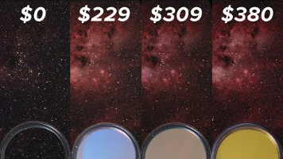
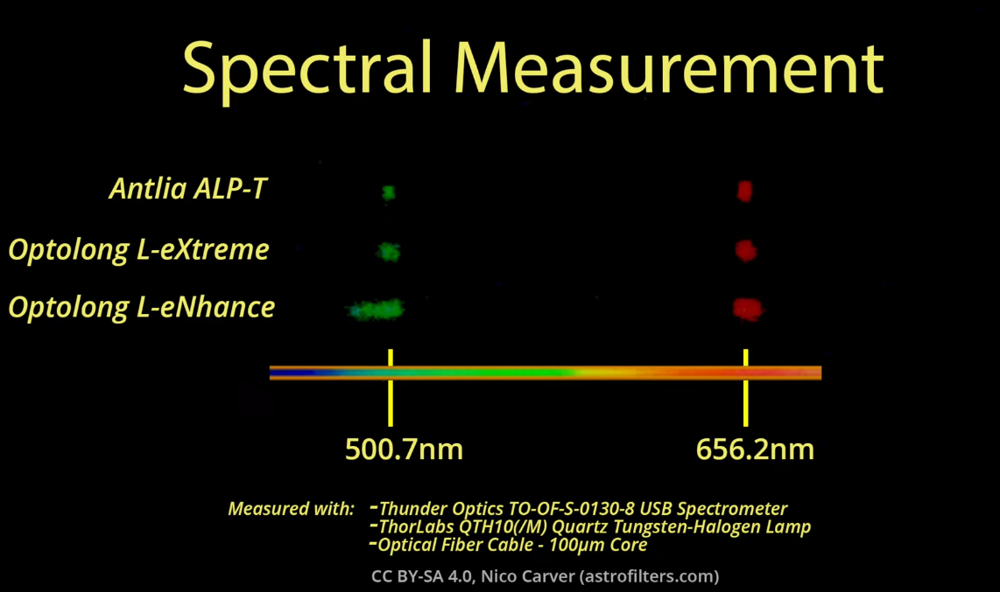

Reference: [Dual Narrowband Filters Shootout: Optolong L-eNhance vs. Antlia ALP-T vs. Optolong L-eXtreme](https://www.youtube.com/watch?v=9T2HvIyo-gg)

# Overview

- Used to photograph emission nebulae from light-polluted cities using color cameras (DSLRs or dedicated astrophotography cameras)
  - Emission nebulae are nebulae that emit their own light from ionized atoms associated with the different gases in the gas clouds (hydrogen, oxygen, and sulfur)
  - These clouds of gas emit very specific wavelengths of light that filters can be designed to pass
- Isolate light from emission nebulae, specifically the O3 and H-alpha emission line
- Pass light at specific parts of the visible spectrum
- How much of the light they pass is called the **band pass**
  - Anything not included in the band pass is blocked
- Also work for blocking light pollution

# What they are NOT good for

- Anything other than emission nebulae
- Natural star color
- Reflection nebulae
- Other galaxies (might be possible if the galaxy has a lot of emission nebulae like M33)
  - Galaxies are typically taken with broadband filters, not narrowband filters

# Popular Filters

- Optolong L-Enhance ($229)
- Optolong L-Extreme ($309)
- Antlia ALP-T ($380)

# Spectral Measurement

- All three filters are well centered on the emission line, but the more expensive filters have the tighter band passes

